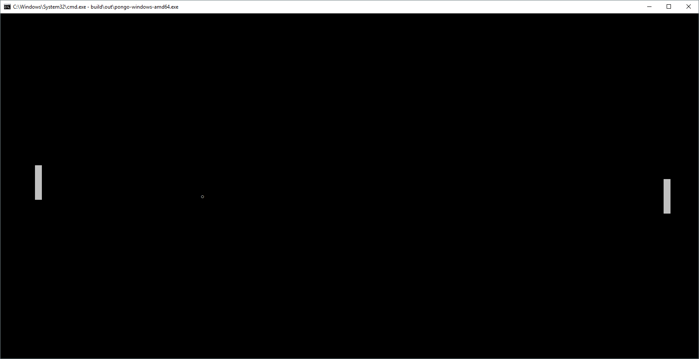

### Pongo

Super simple pong implementation in Golang. This is not a fully fledged game, because I primarily wanted to learn about Go and its Goroutines.

The main logic is ball-driven, where at a fixed rate 30ms we are issuing an update to the balls position as part of a goroutine.
This is consumed by the CPU player (another goroutine) to update its position towards the ball.
The human player position is driven by a keyboard goroutine that handles key presses.  

The renderer completely operates asynchronously to the goroutines and just copies the game state into the frame buffer.



Build 
-----

You will need Gradle and you can simply build using:

> gradle build

That will create 64bit binaries for Linux, Windows and MacOs in ```build/out/```.
